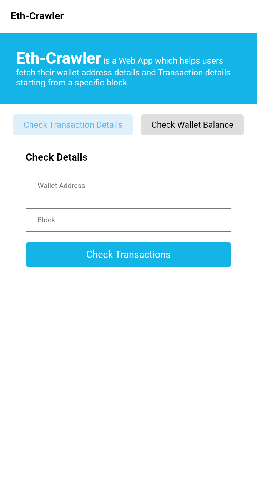
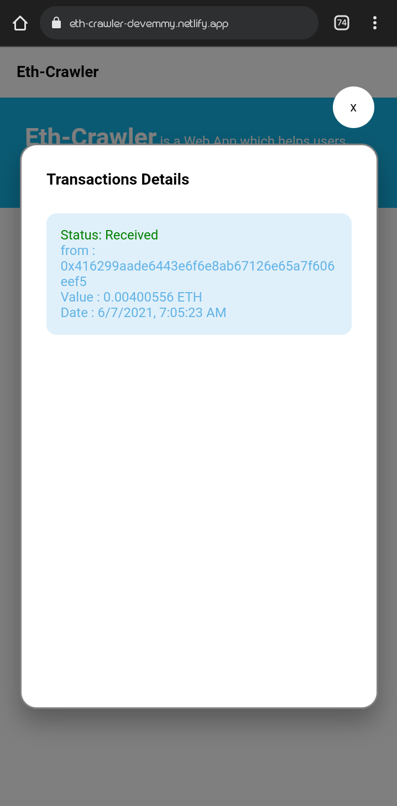
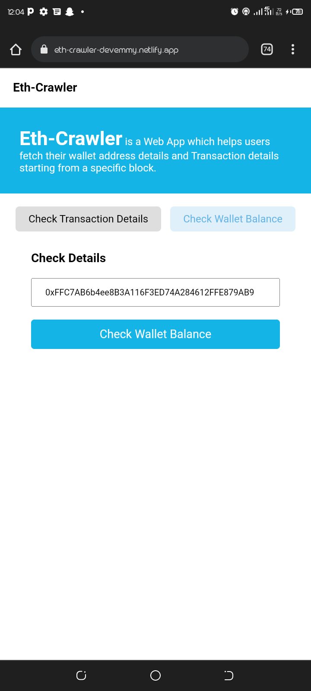
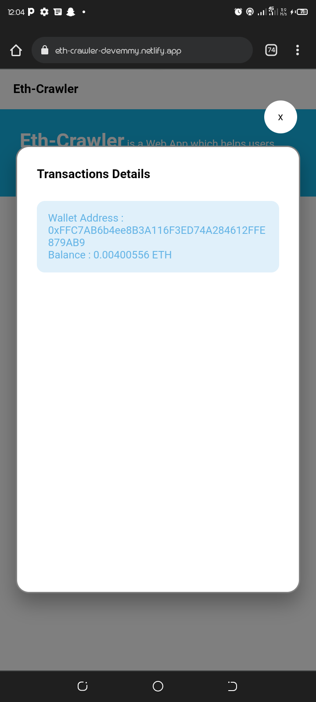

# Eth Crawler
This is a project that helps users fetch their transactions and wallet details associated with their Etheruem wallet address. This project was built with React as it client-side and consumed an api from [EtherScan](https://ethercan.io)

## Run the Project

Before you run the project, you need to generate an api key from [EtherScan](https://ethercan.io), then create a file called `.env` file and declare a variable called "API_KEY".

In the project directory, you can then run:

### `npm start`

Runs the app in the development mode.\
Open [http://localhost:3000](http://localhost:3000) to view it in your browser.

The page will reload when you make changes.\
You may also see any lint errors in the console.

## View Demo
You can view the demo here - [https://eth-crawler.netlify.app](https://eth-crawler.netlify.app) 

## Previews

